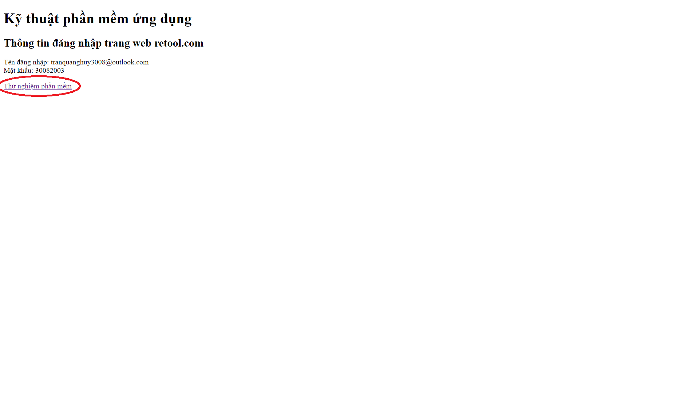
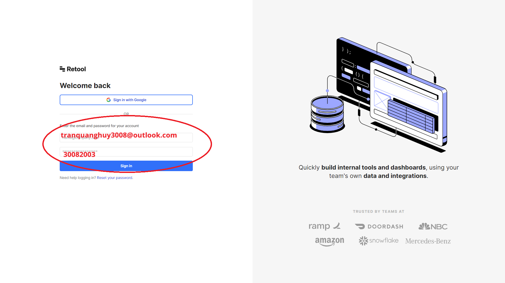
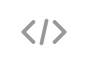
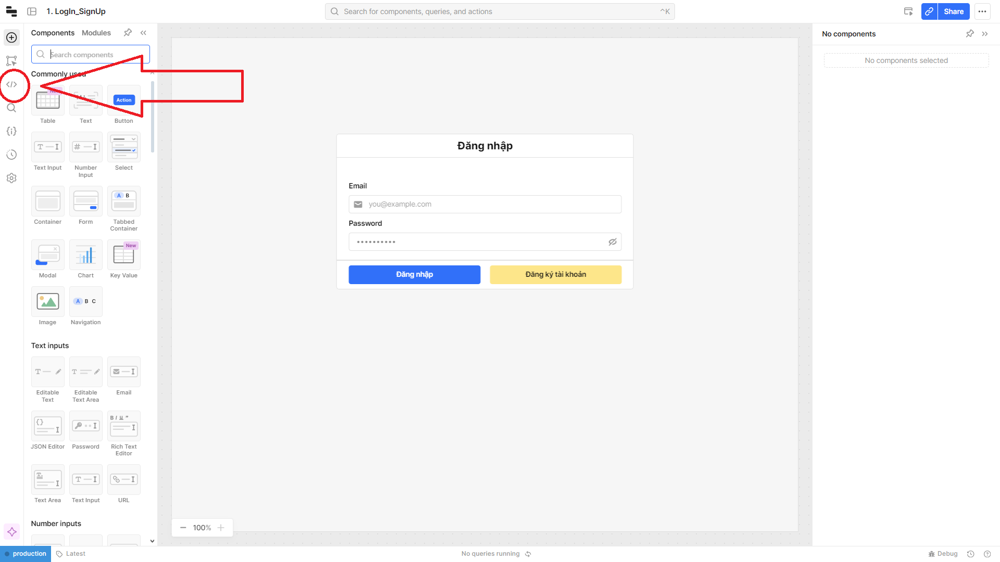
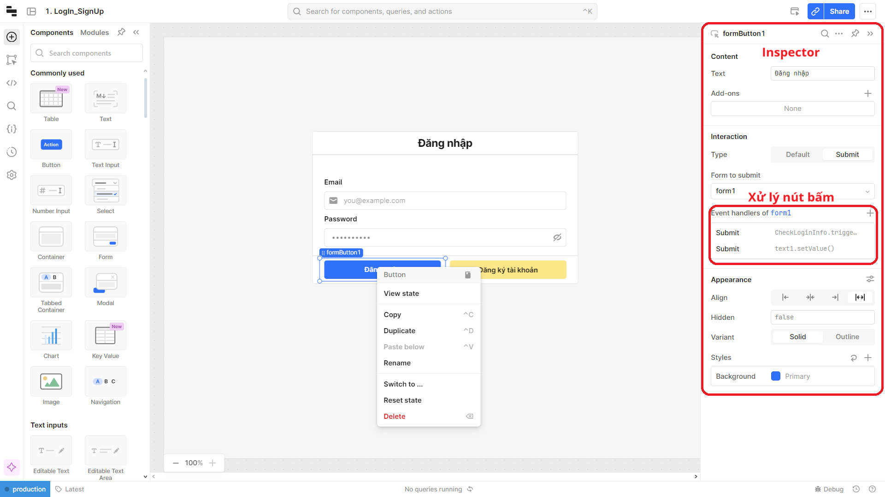

# Hướng Dẫn Xem Code trên Retool.com

## 1️⃣ Đăng Nhập vào Ứng Dụng

1. Truy cập [phần mềm](https://dark-greencat.github.io/AGV_Server/), click *Thử nghiệm phần mềm* và đăng nhập vào tài khoản trên màn hình.

2. Mở ứng dụng sau khi đăng nhập.

## 2️⃣ Chỉnh Sửa Ứng Dụng

3. Sau khi mở ứng dụng, thầy nhấp vào nút "Edit App" để bắt đầu quá trình chỉnh sửa.

_Truy cập tài khoản mẫu để vào giao diện chính:_

_Tên đăng nhập: a@a.com_  
_Password: 12345678_

## 3️⃣ Xem Code

4. Trong trình chỉnh sửa, thầy có thể tìm và nhấp vào biểu tượng   trên màn hình để xem mã nguồn của ứng dụng.

Các mã xử lý và SQL script được chúng em đặt tại đây. Ngoài ra với từng Nút bấm khi chọn vào cũng có các mã xử lý riêng trong mục **Inspector**

