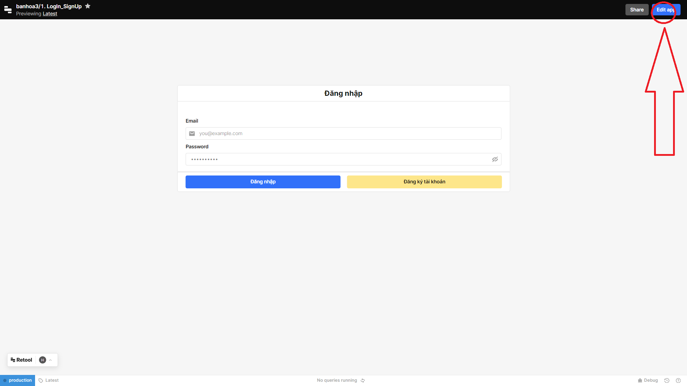

# Hướng Dẫn Xem Code trên Retool.com

## Đăng Nhập vào Ứng Dụng

1. Truy cập [retool.com](https://dark-greencat.github.io/AGV_Server/), click *Thử nghiệm phần mềm* và đăng nhập vào tài khoản trên màn hình.

2. Mở ứng dụng sau khi đăng nhập.

## Chỉnh Sửa Ứng Dụng

3. Sau khi mở ứng dụng, nhấp vào nút "Edit App" để bắt đầu quá trình chỉnh sửa.

## Xem Code

4. Trong trình chỉnh sửa, tìm và nhấp vào biểu tượng  trên màn hình để xem mã nguồn của ứng dụng.

Các mã xử lý và SQL script được đặt tại đây. Ngoài ra với từng *Nút bấm* khi chọn vào cũng có các mã xử lý riêng trong mục **Inspector**
